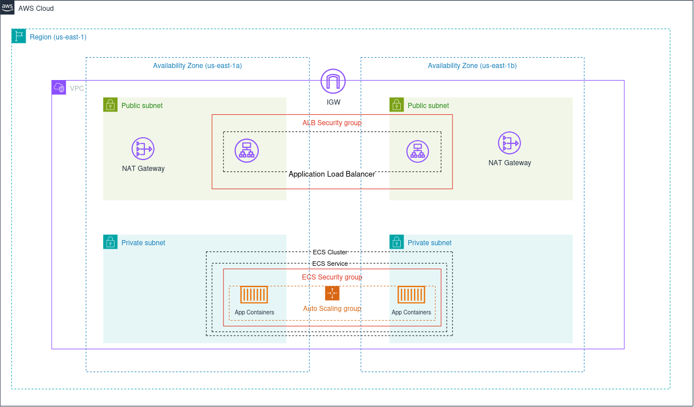

## Architecture Overview

The infrastructure runs entirely on AWS inside a custom VPC split across two availability zones for high availability. The VPC has four subnets: two public and two private. The application never runs in a public subnet.

Public subnets hold the Application Load Balancer and NAT Gateways. The ALB is the only entry point from the internet. It accepts HTTP on port 80 and redirects to HTTPS on port 443 if a certificate is provided, or forwards directly to the app otherwise.

Private subnets hold the ECS Fargate tasks running the Flask application. These have no public IPs. Outbound traffic (to pull images from ECR, send logs to CloudWatch) goes through the NAT Gateways.

The ECS service runs a minimum of two tasks spread across the two AZs. Auto scaling adjusts the count based on CPU utilization, it scales out when CPU hits 70% and scales back in when load drops (target tracking policy). Deployments are rolling with zero downtime, new tasks must be healthy before old ones are removed, and a circuit breaker automatically rolls back if the new version fails health checks.

Container images are stored in Amazon ECR with vulnerability scanning on every push. Terraform state is stored in an S3 bucket with native file locking. CloudWatch monitors CPU utilization and ALB 5XX error rates, with alarms that notify via email through SNS.

## Architecture Diagram

 

## Deployment Instructions

Before the first deploy you need three things: an S3 bucket for Terraform state, a GitHub OIDC provider registered in your AWS account, and your tfvars file filled in.

Create the S3 bucket with versioning and encryption enabled. Then register GitHub as an OIDC provider in IAM (this is a one-time operation that tells AWS to trust JWT tokens issued by GitHub Actions).

For the first deploy run terraform init, then terraform plan to review what will be created, then terraform apply. This provisions everything: VPC, subnets, ALB, ECS cluster, ECR repo, IAM roles, CloudWatch alarms.

After the first apply, copy the cicd_role_arn output value and add it as a secret named AWS_ROLE_ARN in your GitHub repository. From that point on, every push to main triggers the pipeline which handles all future deployments automatically.

The environments/production.tfvars file serves as a single source of truth for the variables of the environment. It contains only the non-sensitive config values, which the CI/CD pipeline uses during deployment. The sensitive values are stored as repository secrets.

## CI/CD Workflow

The pipeline has six stages that run in order. Every push and pull request to main triggers the first three. The last three only run on a direct push to main.

### Stage 1 - Validate: 
Checks out the code, installs Terraform, runs format check and validate. Catches syntax errors and formatting issues before anything else runs.

### Stage 2 - Security Scan: 
Runs Checkov against all Terraform code. If any HIGH or CRITICAL misconfiguration is found the pipeline stops here. Results are also uploaded to the GitHub Security tab as a SARIF report for ongoing visibility.

### Stage 3 - Plan: 
Runs terraform plan and posts the output as a comment on the pull request so reviewers can see exactly what infrastructure changes will happen before approving.

### Stage 4 - Build and Push:
 Builds the Docker image and pushes it to ECR tagged with the git commit SHA. Only runs on main.

### Stage 5 - Apply: 
Runs terraform apply with the new image tag. Tied to a GitHub environment named "production", you can add required reviewers here if you want manual approval before infrastructure changes go through.

### Stage 6 - Deploy: 
Registers a new ECS task definition pointing to the new image and triggers a rolling update on the ECS service. Waits for the service to stabilize before marking the job complete. If the new tasks fail health checks, ECS automatically rolls back.

### Security Note: 
No AWS credentials are stored anywhere. GitHub Actions authenticates to AWS by exchanging a short-lived signed JWT token for temporary STS credentials via OIDC. The credentials expire after roughly one hour and are scoped to only the permissions the CI/CD role needs.

## Security Considerations

### Network isolation: 
Application workloads run in private subnets with no public IPs. The only public-facing resource is the ALB. The ECS security group only accepts traffic from the ALB security group, nothing else can reach the containers directly.

### IAM least privilege: 
Three separate IAM roles exist with minimal permissions each. The task execution role can only pull images from ECR and write logs. The task role can only write to its own log group. The CI/CD role can push images, update the ECS service, and read/write Terraform state. Inline policies are used to limit the permissions to specific resources. 

### No static credentials:
The CI/CD pipeline uses OIDC. GitHub Actions proves its identity with a signed token and receives temporary credentials. There are no access keys stored in GitHub secrets.

### Container hardening: 
The container runs as a non-root user. All Linux kernel capabilities are dropped, the process has no low-level system access even if compromised. Note: The read-only root file system was dropped since gunicorn couldn't write to /tmp, and since this filesystem contains no sensitive data.

### Infrastructure scanning:
Checkov runs on every pipeline execution before any apply is allowed. HIGH and CRITICAL findings block the pipeline. SARIF results persist in the GitHub Security tab so issues are visible over time.

### State security: 
Terraform state is stored in an encrypted S3 bucket. State files can contain sensitive values so encryption and restricted bucket access are important. Native S3 file locking prevents concurrent applies from corrupting state.

### Image security: 
ECR scans every image on push for known vulnerabilities. Untagged images are automatically cleaned up by lifecycle policies to reduce the exposure window.